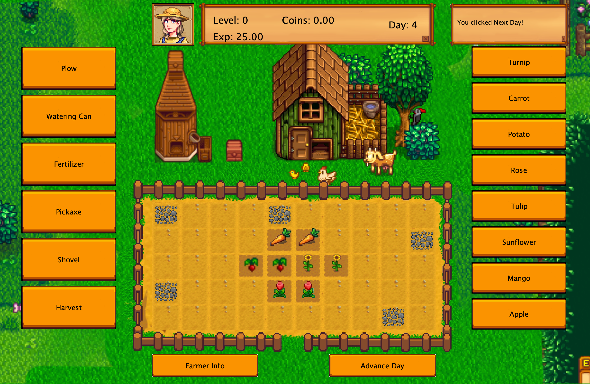
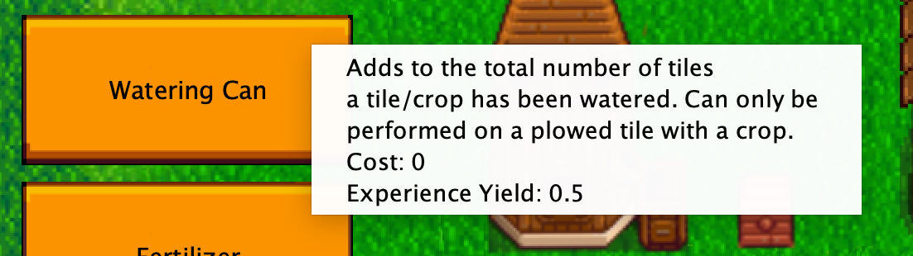
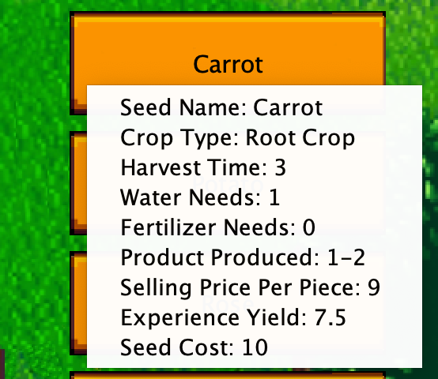
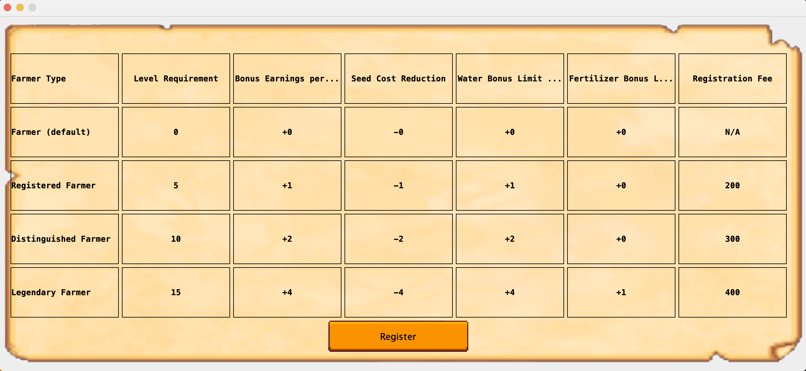
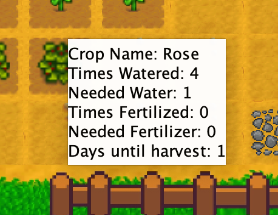

# Stardew Farm Simulator

  
*Figure 1: Main game interface showing farm tiles, tools, and crops*

A Java-based farming simulation game inspired by Stardew Valley.

## Features
- 8 different crops to grow (root crops, flowers, fruit trees)
- Farmer progression system with 4 tiers
- Day/night cycle with day advancement
- Tool system for farm maintenance
- Crop requirements and bonuses
- Visual feedback for all actions

## How to Run
1. Ensure you have Java JDK installed
2. Clone/download the repository
3. Open the project in your preferred Java IDE
4. Run `Main.java` to start the game

## Game Controls
- **Left-click**:
  - Select tools from left panel
  - Select seeds from right panel
  - Click on farm tiles to perform actions
- **Right-click**:
  - View crop/tile information
  - View tool/seed details

  
*Figure 2: Right-click tool information popup*

  
*Figure 3: Seed details available via right-click*

## How to Play
1. **Start Farming**:
   - Use tools to prepare your land (plow, remove rocks)
   - Buy and plant seeds from the right panel
   - Water and fertilize your crops daily

2. **Advance Days**:
   - Click "Advance Day" to progress time
   - Crops grow over time and can be harvested when ready

3. **Earn Money**:
   - Sell harvested crops
   - Use profits to buy better seeds and tools

4. **Level Up**:
   - Gain experience from farming activities
   - Reach level milestones to unlock farmer promotions

5. **Promote Your Farmer**:
   - Click "Farmer Info" to view requirements
   - When eligible, click "Register" to promote your farmer

  
*Figure 4: Farmer promotion window showing available tiers*

## Farmer Tiers

  
*Figure 5: Detailed farmer type requirements and bonuses*

1. **Farmer** (Default) - No bonuses
2. **Registered Farmer** (Level 5, 200 coins)
   - +1 bonus earnings
   - -1 seed cost
3. **Distinguished Farmer** (Level 10, 300 coins)
   - +2 bonus earnings
   - -2 seed cost
   - +1 water bonus
4. **Legendary Farmer** (Level 15, 400 coins)
   - +4 bonus earnings
   - -3 seed cost
   - +2 water bonus
   - +1 fertilizer bonus

## Crop Types
1. **Root Crops**: Turnip, Carrot, Potato
2. **Flowers**: Rose, Tulip, Sunflower
3. **Fruit Trees**: Mango, Apple

  
*Figure 6: Detailed crop growth information*

## Tools
1. Plow - Prepare land for planting
2. Watering Can - Water your crops
3. Fertilizer - Boost crop growth
4. Pickaxe - Remove rocks
5. Shovel - Clear tiles
6. Harvest - Collect mature crops

## Requirements
- Java JDK 11 or higher
- Image files in the same directory as source code